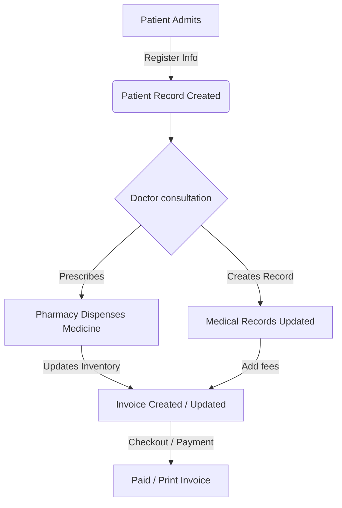
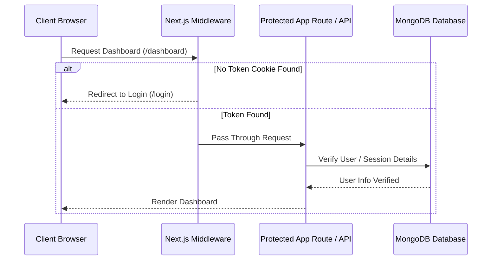

<div align="center">

# 🏥 MedCore - Advanced Hospital Management System
### *Empowering healthcare facilities with modern, real-time, data-driven management.*

[](https://nextjs.org/)
[](https://react.dev/)
[](https://www.typescriptlang.org/)
[](https://tailwindcss.com/)
[](https://www.mongodb.com/atlas)
[](https://www.framer.com/motion/)

<p align="center">
  A state-of-the-art, feature-rich <strong>Hospital Management System (HMS)</strong> built with <strong>Next.js 14 App Router</strong>, <strong>Mongoose</strong>, and <strong>Zustand</strong>. Offers micro-interactions, responsive views, unified patient history, pharmacy stocks, billing pipelines, and interactive analytics.
</p>

### 🚀 [Live Deployment Website](https://medcore-kw5m.onrender.com/)

> 🔑 **Demo Admin Credentials** *(Read-Only Mode)*
> * **Email:** `demoadmin@medcore.com`
> * **Password:** `demoadmin123`

[✨ Key Features](#-key-features) • [📂 Project Structure](#-project-structure) • [⚙️ Architecture Workflows](#-architecture-workflows) • [💻 Setup Guide](#-setup-guide) • [🗃️ Database Models](#%EF%B8%8F-database-models)

---

</div>

## 🌟 Key Features

<table width="100%">
  <tr>
    <td width="50%" valign="top">
      <h4>⚡ Real-Time Dashboard Analytics</h4>
      <ul>
        <li>📊 Admissions & Occupancy charts via Recharts.</li>
        <li>🔄 Dynamic activity feeds tracking administrative transactions.</li>
        <li>🚨 Live widgets display critical metrics (doctors on duty, appointments queue).</li>
      </ul>
    </td>
    <td width="50%" valign="top">
      <h4>📂 Medical Records & Patient Profiles</h4>
      <ul>
        <li>📁 Rich history logs with diagnoses, allergies, and lab results.</li>
        <li>🩺 Real-time vitals monitoring tracking blood pressure, pulse, etc.</li>
        <li>➕ Streamlined registration for IPD, OPD, and Emergency admissions.</li>
      </ul>
    </td>
  </tr>
  <tr>
    <td width="50%" valign="top">
      <h4>🗓️ Appointment Scheduler</h4>
      <ul>
        <li>🕒 Intuitive state machine supporting booking, check-in, completion, or cancellations.</li>
        <li>🔍 Advanced filters (by Department, Doctor, Date, or Status).</li>
        <li>👤 Direct Patient profile lookup integration.</li>
      </ul>
    </td>
    <td width="50%" valign="top">
      <h4>💊 Smart Pharmacy & Inventory</h4>
      <ul>
        <li>📦 Stock control and automatic low-stock alerts.</li>
        <li>🛒 Sales records mapping dispensed items back to patients.</li>
        <li>🏷️ Categories tracking and expiration date alerts.</li>
      </ul>
    </td>
  </tr>
  <tr>
    <td width="50%" valign="top">
      <h4>💳 Dynamic Billing & Invoicing</h4>
      <ul>
        <li>📝 Automated invoice compilation (fees, taxes, discounts, prescriptions).</li>
        <li>🏦 Tracking for paid, unpaid, or partial transactions.</li>
        <li>🖨️ Clean print layout wrapper for physical documentation.</li>
      </ul>
    </td>
    <td width="50%" valign="top">
      <h4>🔒 Middleware-Secured Admin Panel</h4>
      <ul>
        <li>🔑 Role-based cookie authorization checks using Next.js Middleware.</li>
        <li>📡 Dynamic token verification & session validation.</li>
        <li>📝 Admin panel for monitoring user accounts and hospital config.</li>
      </ul>
    </td>
  </tr>
</table>

---

## 🔑 Access Control & User Roles

The system employs a strict Role-Based Access Control (RBAC) model. Below is the permissions matrix detailing the rights of each user role:

| Role | What They Can Do | How They Can Do It |
| :--- | :--- | :--- |
| 👑 **Administrator (`admin`)** | Has full read and write access across all hospital subsystems and can register new staff accounts. | Operates via the full dashboard, scheduler, patient list, billing portal, pharmacy stocks, and the [Staff Registration portal under Settings](file:///c:/Users/NITRO%205/OneDrive/Desktop/HMS-main/app/settings/page.tsx). |
| 🩺 **Doctor (`doctor`)** | Manage clinical diagnoses, view patient medical histories, prescribe medications, and view scheduled consultations. | Accesses the [Patients Directory](file:///c:/Users/NITRO%205/OneDrive/Desktop/HMS-main/app/patients/page.tsx) to edit clinical logs, views upcoming visits on the [Appointments Queue](file:///c:/Users/NITRO%205/OneDrive/Desktop/HMS-main/app/appointments/page.tsx), and manages personal details under [Settings](file:///c:/Users/NITRO%205/OneDrive/Desktop/HMS-main/app/settings/page.tsx). |
| 🩹 **Nurse (`nurse`)** | Check patients in, record active vital signs (BP, heart rate, spO2), check allergies, and monitor ward occupancy. | Updates records from the patient cards on the [Patients](file:///c:/Users/NITRO%205/OneDrive/Desktop/HMS-main/app/patients/page.tsx) and [Appointments](file:///c:/Users/NITRO%205/OneDrive/Desktop/HMS-main/app/appointments/page.tsx) screens, and tracks hospital admissions from the dashboard. |
| 📋 **Receptionist (`receptionist`)** | Register new patient records, schedule or reschedule appointments, change shift allocations for doctors, and manage billing/invoices. | Uses the patient registration forms, the interactive calendars on the [Appointments scheduler](file:///c:/Users/NITRO%205/OneDrive/Desktop/HMS-main/app/appointments/page.tsx), doctor shift buttons, and processes checkouts inside the [Billing Portal](file:///c:/Users/NITRO%205/OneDrive/Desktop/HMS-main/app/billing/page.tsx). |
| 💊 **Pharmacist (`pharmacist`)** | View medicine catalogs, restock depleted pharmaceutical supplies, and log prescription dispenses for registered patients. | Utilizes the inventory controls, Procure Medicine dialogs, and Dispense forms on the [Pharmacy Inventory](file:///c:/Users/NITRO%205/OneDrive/Desktop/HMS-main/app/pharmacy/page.tsx) screen. |
| 👤 **Patient (`patient`)** | View their own medical records, check doctor directories/availability, and view pending or past bills. | Views view-only views in [Patients Directory](file:///c:/Users/NITRO%205/OneDrive/Desktop/HMS-main/app/patients/page.tsx) (for their own data), staff listings under [Doctors](file:///c:/Users/NITRO%205/OneDrive/Desktop/HMS-main/app/doctors/page.tsx), and invoice status on [Billing](file:///c:/Users/NITRO%205/OneDrive/Desktop/HMS-main/app/billing/page.tsx). |

---

## 📂 Project Structure

Below is an overview of the key directories and architectural layers inside `medcore`:

```bash
HMS-main/
├── app/                        # 🌐 Next.js App Router pages and layout structure
│   ├── api/                    # 📡 Backend Route Handlers (REST Endpoints)
│   │   ├── activities/         # Logs system audit trials & actions
│   │   ├── appointments/       # Handles bookings & scheduling pipelines
│   │   ├── auth/               # Session login, logout, and token check
│   │   ├── billing/            # Handles invoicing & transaction states
│   │   ├── doctors/            # Retrieves and updates schedules/status
│   │   ├── patients/           # Manages patient registration & clinical files
│   │   ├── pharmacy/           # Pharmacy stock control and sales records
│   │   └── system/             # Aggregates system metrics & hospital loads
│   ├── dashboard/              # 📊 Main workspace containing analytics dashboard
│   ├── appointments/           # 🗓️ Scheduler, lists, and filter widgets
│   ├── billing/                # 💳 Invoice lists, print layouts, and checkout panel
│   ├── doctors/                # 🩺 Staff registry and shifts calendar
│   ├── patients/               # 👤 Clinical patient logs and record registry
│   ├── pharmacy/               # 💊 Drug catalog, transactions, and status indicators
│   ├── records/                # 📁 Lab reports, clinical charts, and summaries
│   ├── settings/               # ⚙️ General system and configuration parameters
│   └── globals.css             # 🎨 Core styling and theme configurations (Tailwind)
├── components/                 # 🧱 Modular UI & Layout components
│   ├── dashboard/              # StatsCards, AdmissionsChart, OccupancyDonut
│   ├── layout/                 # Sidebar, Topbar, MainLayout shell wrappers
│   └── ui/                     # Modular elements (Buttons, Inputs, Modals, Badges)
├── hooks/                      # 🪝 Reactive application custom hooks
│   ├── useStore.ts             # Global state controller using Zustand
│   └── useAppointments.ts      # Custom scheduler actions and calendar state machine
├── lib/                        # 🛠️ Shared services, database models, and utils
│   ├── models/                 # 🗄️ Mongoose Models (Schemas for Patient, Invoice, etc.)
│   ├── constants.ts            # 🏷️ Predefined constant enums (Blood Groups, Depts, etc.)
│   ├── mongodb.ts              # 🔌 DB connector configured with Google/Cloudflare DNS fallbacks
│   └── utils.ts                # 📐 Tailwind merge rules, numbers & date utilities
└── types/                      # 🏷️ Centralized TypeScript definitions & schemas
```

---

## ⚙️ Architecture Workflows

### 1. Patient Lifecycle & Billing Pipeline
This workflow tracks a patient from registration through diagnosis, prescription dispensing, and checkout:



### 2. Authentication & Middleware Security
How pages and API endpoints are guarded from unauthorized access:



---

## 🗃️ Database Models

MedCore operates on top of MongoDB using the following Mongoose schemas configured in [lib/models/](file:///c:/Users/NITRO%205/OneDrive/Desktop/HMS-main/lib/models/):

| Model | Schema File | Key Attributes | Purpose |
| :--- | :--- | :--- | :--- |
| **User** | [User.ts](file:///c:/Users/NITRO%205/OneDrive/Desktop/HMS-main/lib/models/User.ts) | `username`, `password`, `email`, `role` | Authentication credentials & ACL roles. |
| **Patient** | [Patient.ts](file:///c:/Users/NITRO%205/OneDrive/Desktop/HMS-main/lib/models/Patient.ts) | `name`, `gender`, `bloodGroup`, `status` | Identity, blood type, and tracking status. |
| **Doctor** | [Doctor.ts](file:///c:/Users/NITRO%205/OneDrive/Desktop/HMS-main/lib/models/Doctor.ts) | `name`, `department`, `status`, `experience` | Practitioner directory, department, and active status. |
| **Appointment** | [Appointment.ts](file:///c:/Users/NITRO%205/OneDrive/Desktop/HMS-main/lib/models/Appointment.ts) | `patientId`, `doctorId`, `date`, `status` | Booking scheduling & department assignments. |
| **MedicalRecord** | [MedicalRecord.ts](file:///c:/Users/NITRO%205/OneDrive/Desktop/HMS-main/lib/models/MedicalRecord.ts) | `patientId`, `diagnoses`, `vitals`, `allergies` | Clinical records, lab logs, and history tracking. |
| **Invoice** | [Invoice.ts](file:///c:/Users/NITRO%205/OneDrive/Desktop/HMS-main/lib/models/Invoice.ts) | `patientId`, `items`, `amount`, `status` | Payment items, taxes, discounts, and payment status. |
| **Medicine** | [Medicine.ts](file:///c:/Users/NITRO%205/OneDrive/Desktop/HMS-main/lib/models/Medicine.ts) | `name`, `stock`, `expiryDate`, `price` | Pharmacy catalog and current physical inventory. |
| **ActivityLog** | [ActivityLog.ts](file:///c:/Users/NITRO%205/OneDrive/Desktop/HMS-main/lib/models/ActivityLog.ts) | `user`, `action`, `details`, `timestamp` | Global administrative action logs. |

---

## 💻 Setup Guide

Follow these steps to run a local instance of the application:

### Prerequisites
* **Node.js** (v18.x or later recommended)
* **MongoDB Atlas URI** (or local Mongo Server instance)

### 1. Environment Variables Configuration
Create a `.env` file in the root directory and specify the connection URI:
```env
MONGODB_URI=mongodb+srv://<username>:<password>@cluster.mongodb.net/<dbname>?retryWrites=true&w=majority
```

### 2. Install Dependencies
```bash
npm install
```

### 3. Running the Application
```bash
# Run Development Server
npm run dev

# Build for Production
npm run build

# Start Production Server
npm run start
```

Open [http://localhost:3000](http://localhost:3000) in your browser to interact with the dashboard!

---

<div align="center">
  <sub>Developed with 💙 for hospital administration efficiency.</sub>
</div>
